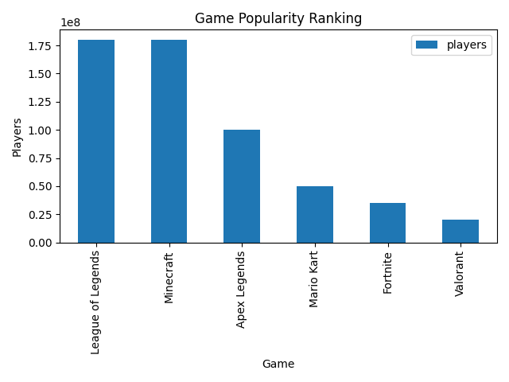

# データ分析ポートフォリオ

Python（Pandas, Matplotlib）を使用したデータ分析ポートフォリオです。

---

## 📊 プロジェクト

### 1. Steamゲームデータ分析
- ジャンル別プレイヤー数
- 年ごとのプレイヤー推移
- 無料ゲームと有料ゲームの比較



---

### 2. eコマース売上分析
- 月別売上
- 商品別売上
- カテゴリ別売上


---

### 3. RFM顧客分析
- 顧客をVIP / Loyal / Potential / Churnに分類
- スコアリングによる顧客セグメント分析


---

## 🛠 使用技術
- Python（Pandas, Matplotlib）
- SQL
- データ可視化
- 統計分析

---

## 🚀 実行方法

```bash
pip install pandas matplotlib
python main.py
```
