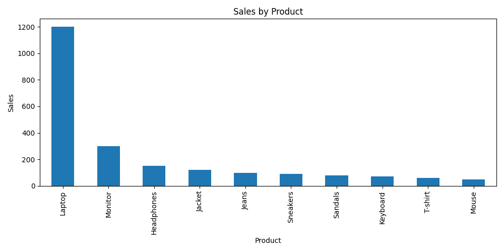
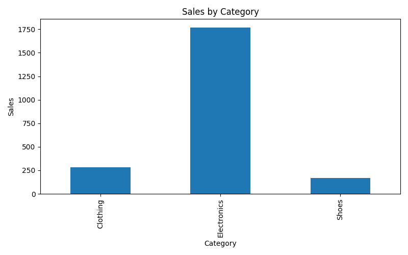
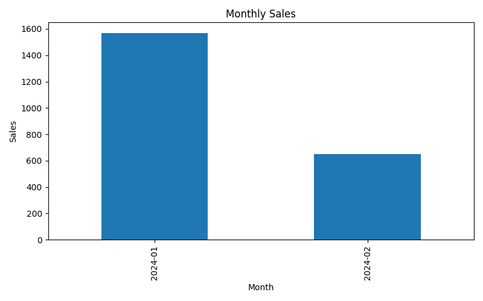

# E-commerce Sales Analysis

This project analyzes e-commerce sales data to identify trends in product performance and category sales.

## Tools

* Python
* Pandas
* Matplotlib

## Data

The dataset contains order information including product, category, price, quantity, and order date.

## Analysis

1. Sales by Product
2. Sales by Category
3. Monthly Sales Trend

## Results

* Electronics generate the highest revenue among categories.
* Some products significantly outperform others in sales.

## Visualizations

### Product Sales

### Category Sales

### Monthly Sales

